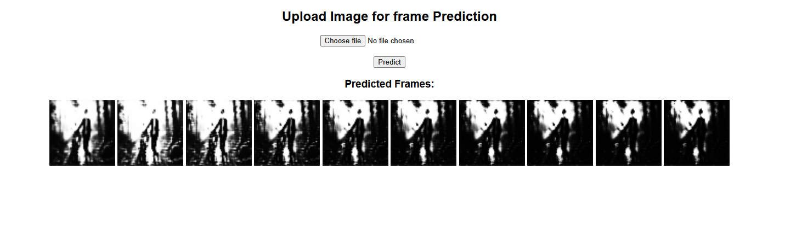

# 🎥 Future Frame Prediction Using CNN-LSTM

A Deep Learning project that predicts future image frames using a CNN-LSTM model. The application is developed using **TensorFlow, Keras, OpenCV, Flask, and NumPy**.

---

# 📌 Project Preview

> Replace these images with your own screenshots.

## Home Page




## Prediction Result


---

## Generated Frames


---

# 🚀 Project Overview

This project demonstrates **Future Frame Prediction** using a CNN-LSTM architecture.

The application allows users to upload an image, preprocesses it using OpenCV, converts it into a frame sequence, and predicts future frames using a trained deep learning model.

---

# ✨ Features

- Upload Image
- Image Preprocessing
- CNN Feature Extraction
- LSTM Sequence Learning
- Future Frame Prediction
- Flask Web Interface
- TensorFlow Model
- OpenCV Integration

---

# 🛠 Technologies Used

- Python
- TensorFlow
- Keras
- OpenCV
- Flask
- NumPy
- HTML
- CSS

---

# 📂 Project Structure

```
Future-Frame-Prediction-Using-CNN-LSTM/
│
├── app.py
├── video_model.h5
├── requirements.txt
├── README.md
│
├── templates/
│   └── index.html
│
├── static/
│
└── screenshots/
    ├── home.png
    ├── upload.png
    ├── output.png
    └── frame_prediction.png
```

---

# ⚙️ Installation

Clone the repository

```bash
git clone https://github.com/Vi9dprajapati/Future-Frame-Prediction-Using-CNN-LSTM.git
```

Move into the project folder

```bash
cd Future-Frame-Prediction-Using-CNN-LSTM
```

Install dependencies

```bash
pip install -r requirements.txt
```

Run the application

```bash
python app.py
```

Open in browser

```
http://127.0.0.1:5000
```

---

# 🔄 Workflow

```
Input Image
      │
      ▼
Resize Image
      │
      ▼
Convert to Grayscale
      │
      ▼
Normalize Pixel Values
      │
      ▼
Create Image Sequence
      │
      ▼
CNN Feature Extraction
      │
      ▼
LSTM Sequence Learning
      │
      ▼
Future Frame Prediction
      │
      ▼
Display Predicted Frames
```

---

# 📸 Output

The trained CNN-LSTM model generates a sequence of predicted future frames from the uploaded image.

---

# 🎯 Applications

- Future Frame Prediction
- Video Sequence Modeling
- Motion Prediction
- Deep Learning Research
- Computer Vision
- Educational AI Projects
- CNN-LSTM Demonstration

---

# ⚠️ Limitations

- The current version accepts a single image as input.
- The uploaded image is internally repeated to create a frame sequence.
- For better future frame prediction, the model should be trained using real video frame sequences.

---

# 🔮 Future Improvements

- Video Upload Support
- Real-Time Prediction
- Better Prediction Accuracy
- Color Frame Prediction
- Download Predicted Video
- Improved CNN-LSTM Architecture

---

# 👨‍💻 Author

**Vinod Prajapati**

B.Tech – Computer Science Engineering (AI & Data Science)

### Skills

- Artificial Intelligence
- Deep Learning
- Machine Learning
- Computer Vision
- Python
- TensorFlow
- Flask
- OpenCV

---

# ⭐ If you like this project

Please consider giving this repository a **Star ⭐**.

---

# 📄 License

This project is intended for educational and research purposes only.# Future-Frame-Prediction-Using-CNN-LSTM
